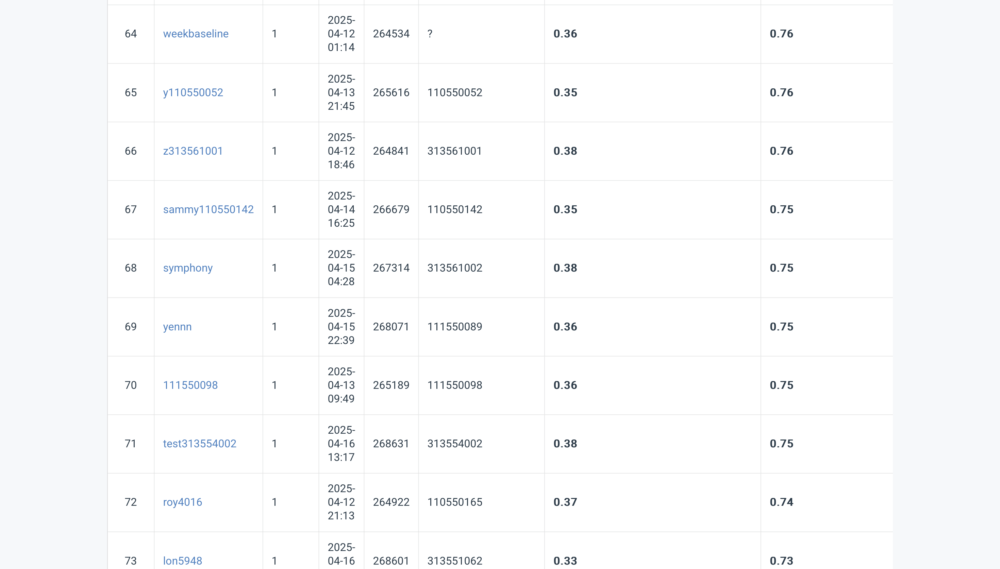

# NYCU Computer Vision 2025 Spring HW2
Student ID: 313561002

Name: 梁巍濤

# Introduction
A Python code implementing a Digit Recognition Task for a dataset of RGB Images and JSON files in COCO format for Training, Validation and Testing. There are two tasks: Task 1 - Bounding Boxes of Digits and Task 2 - Prediction of Digits. This implementation leverages Faster R-CNN with backbone ResNet101-FPN by Pytorch.

# Environment Setup
The notebook is done in a Conda environment, leveraging a NVIDIA GPU for model training.
## Python Version
Python 3.10
## Required Dependencies
```bash
!pip install numpy pandas matplotlib tqdm pillow opencv-python scikit-learn torch torchvision pycocotools
```
## Required Libraries 
```bash
# Standard library imports
import os
import time
import json
import random
import math

# Third-party imports
import numpy as np
import pandas as pd
import matplotlib.pyplot as plt
import cv2
from tqdm import tqdm

# Machine learning imports
from sklearn.ensemble import RandomForestRegressor
from sklearn.metrics import mean_absolute_error
from sklearn.preprocessing import StandardScaler, LabelEncoder

# PyTorch imports
import torch
import torch.utils.data
from torch.optim.lr_scheduler import StepLR

# TorchVision imports
import torchvision
from torchvision.models.detection import FasterRCNN
from torchvision.models.detection.rpn import AnchorGenerator
from torchvision.models.detection.backbone_utils import resnet_fpn_backbone
from torchvision.transforms import functional as F
from torchvision.ops import nms

# Image processing imports
from PIL import Image, ImageDraw

# COCO imports
from pycocotools.coco import COCO
from pycocotools.cocoeval import COCOeval
```
## Installation
1. Clone the repository
2. Install dependencies
3. Run the code

# Performance
The final result in the CodaBench competition returned a result of Task 1: 0.38 mAP score and Task 2: 0.75 accuracy score.


