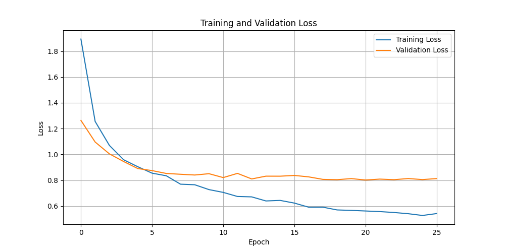
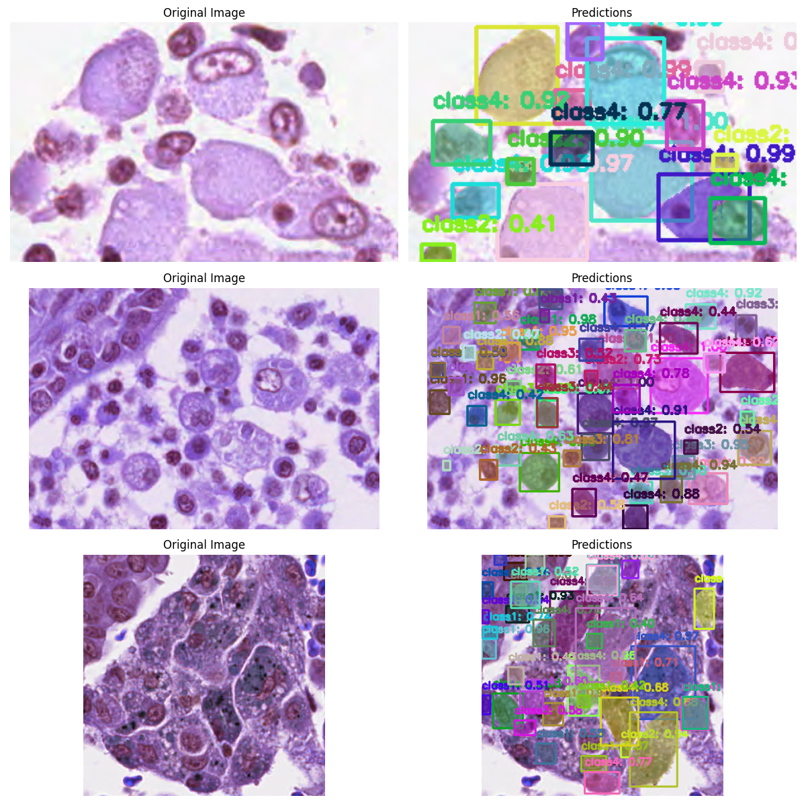
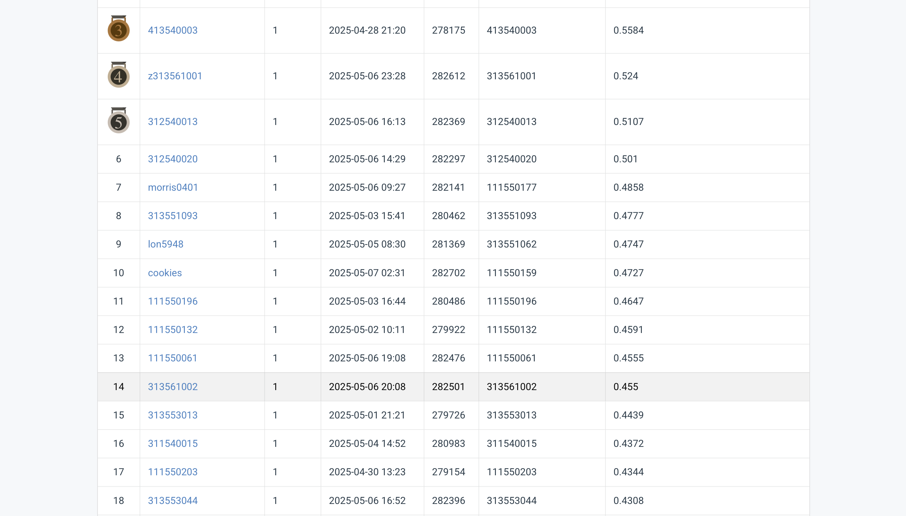

# NYCU Computer Vision 2025 Spring HW3
Student ID: 313561002

Name: 梁巍濤

# Introduction
A Python code implementing a Instance Segmentation Task for a dataset of medical cell images in TIF format for Training, Validation and Testing. This project's main task is to accurately detect and segment four different cell classes in microscopy images. This implementation leverages Mask R-CNN with backbone ResNet-50 by Pytorch, achieving a AP50 score of 0.455.

# Environment Setup
The notebook is done in a Conda environment, leveraging a NVIDIA GPU for model training.
## Python Version
Python 3.10
## Required Dependencies
```bash
!pip install numpy matplotlib pandas opencv-python scikit-image torch torchvision pycocotools tqdm albumentations
```
## Required Libraries 
```bash
# Standard library imports
import os
import json
import random
from pathlib import Path
import shutil
import zipfile

# Third-party imports
import numpy as np
import matplotlib.pyplot as plt
import pandas as pd
import cv2
import skimage.io as sio
from tqdm.auto import tqdm

# PyTorch imports
import torch
from torch.utils.data import Dataset, DataLoader

# TorchVision imports
import torchvision
from torchvision.models.detection import maskrcnn_resnet50_fpn_v2, MaskRCNN_ResNet50_FPN_V2_Weights
from torchvision.models.detection.faster_rcnn import FastRCNNPredictor
from torchvision.models.detection.mask_rcnn import MaskRCNNPredictor

# Image processing imports
import albumentations as A
from albumentations.pytorch import ToTensorV2

# Import from example code by TA
from utils import encode_mask, decode_maskobj
```
## Installation
1. Clone the repository
```
git clone github.com/109550187/VRuDLNYCU/HW3.git
```
2. Install dependencies (follow the pip install above)
3. Run the code
```bash
cd HW3
python3 313561002_HW3.py
```

# Performance
The model trained for 30 epochs and achieved a constant improvement for the training loss up until the last epoch but had plateaud validation loss starting from the 5th epoch.



Here is an example of predicted cell segments plotted using matplotlib.




The final result in the CodaBench competition returned a result of AP50 score of 0.455.


