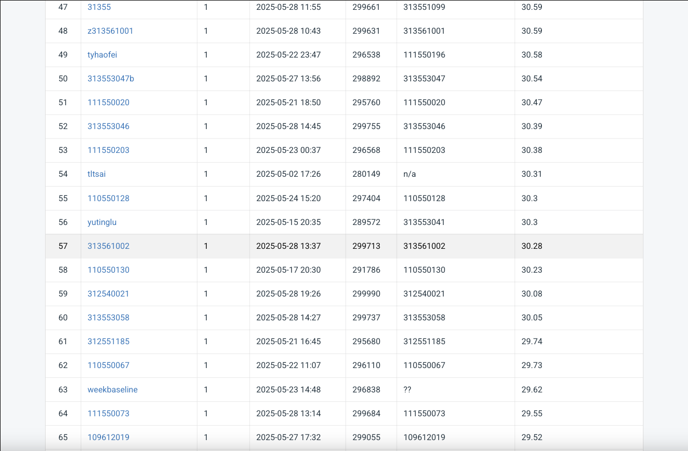

# NYCU Computer Vision 2025 Spring HW4
Student ID: 313561002

Name: 梁巍濤

# Introduction
This project implements an enhanced image restoration model based on PromptIR for handling both rain and snow degradation in images. The task requires training a single model capable of restoring both types of degraded images (rain and snow) and achieving high PSNR scores. The implementation leverages PyTorch Lightning framework with advanced training strategies including multi-loss functions, enhanced optimizers, and channel attention mechanisms to improve restoration quality.

# Task Overview
- Task Type: Image Restoration (Rain and Snow removal)
- Dataset: 1600 degraded images per type (rain/snow) with corresponding clean images for training
- Test Set: 50 degraded images per type (100 total, named 0.png to 99.png)
- Evaluation Metric: PSNR (Peak Signal-to-Noise Ratio)
- Objective: Train a single model to restore both rain and snow degraded images

# Environment Setup
The notebook is done in a Conda environment, leveraging a NVIDIA GPU for model training.

## Python Version
Python 3.10

## Required Dependencies
```bash
!pip install torch torchvision numpy pillow tqdm lightning tensorboard einops
```
## Required Libraries 
```bash
# Core libraries
import torch
import torch.nn as nn
import torch.optim as optim
import torch.nn.functional as F
import lightning.pytorch as pl

# Data handling
import numpy as np
from PIL import Image
from torch.utils.data import DataLoader, Dataset
from torchvision.transforms import ToTensor

# Utilities
import os
import random
from tqdm import tqdm
from einops import rearrange
```
## Installation
1. Clone the repository
```
git clone github.com/109550187/VRuDLNYCU/HW4.git
```
2. Install dependencies (follow the pip install above)
3. Prepare dataset
```bash
hw4_realse_dataset/
├── train/
│   ├── degraded/
│   │   ├── rain-1.png ... rain-1600.png
│   │   └── snow-1.png ... snow-1600.png
│   └── clean/
│       ├── rain_clean-1.png ... rain_clean-1600.png
│       └── snow_clean-1.png ... snow_clean-1600.png
└── test/
    └── degraded/
        ├── 0.png
        ├── 1.png
        └── ... 99.png
```
4. Run the training code
```bash
cd HW4
python train.py
```
5. Run the test code to acquire the submission file "pred.npz"
```bash
cd HW4
python test.py
```

# Performance
The final result in the CodaBench competition returned a result of PSNR score of 30,28.

